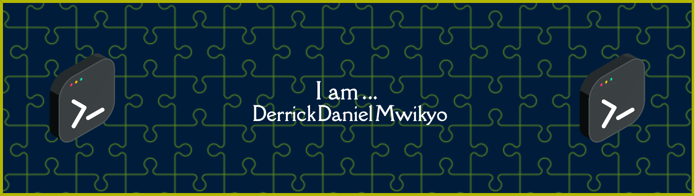

## ABOUT ME ✍️
Hi, I'm Mwikyo.  

SRE on the team behind <a href="https://safeboda.com" style="color:#ff8800; target="_blank">safeboda.com.</a>
 
Less moody in real life. ✌️  

## SOCIAL

  
  
  

## LANGUAGES AND TOOLS

  &nbsp;
  &nbsp;
  &nbsp;
  &nbsp;
  &nbsp;
  &nbsp;
  &nbsp;
  &nbsp;
  &nbsp;
  &nbsp;
  &nbsp;
  &nbsp;
  &nbsp;
  &nbsp;
  

